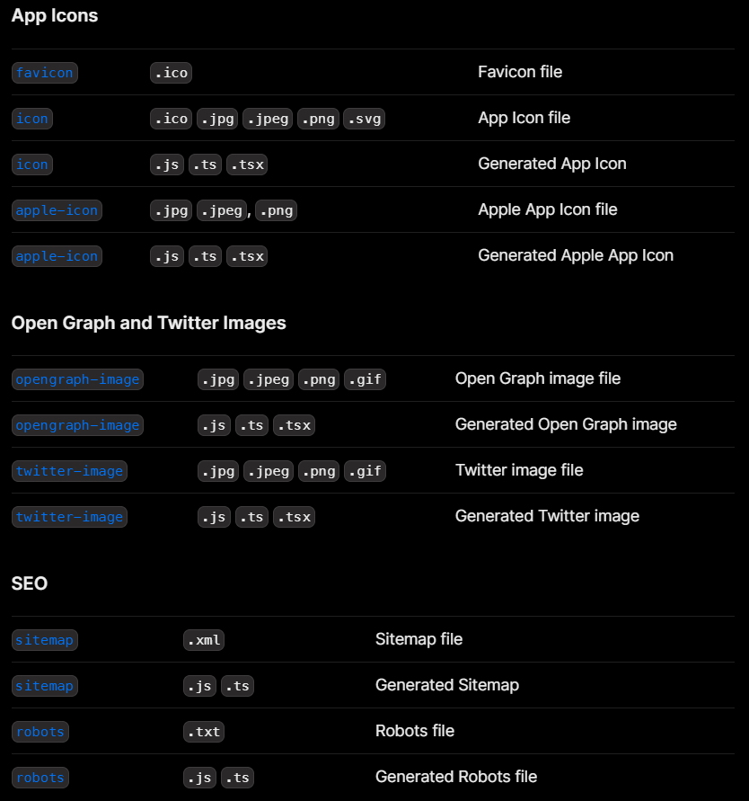

## Metadata File conventions

You can easily setup your icons and add open graph images statically or dynamically using these file conventions.

## Exercise

> Download a picture from the internet and add it as an OpenGraph image on your root layout!

Got a question? Ask Kawtar Live!

In the next chapters, we will learn how to setup metadata and SEO files: robots and sitemap.

---

---

#### Resources

- https://nextjs.org/docs/getting-started/project-structure
