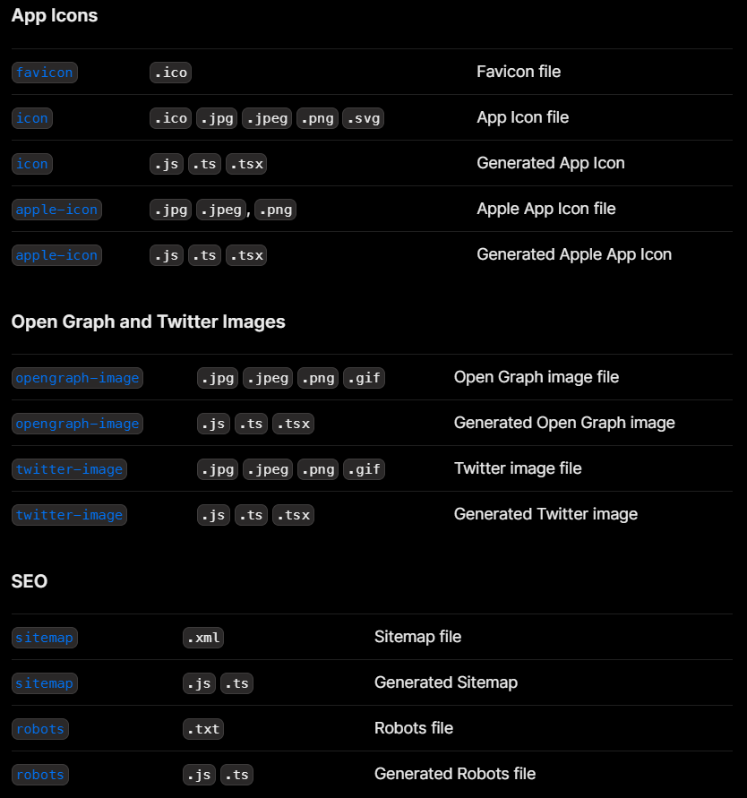

Next.js has a Metadata API that can be used to define your application metadata (e.g. `meta` and `link` tags inside your HTML `head` element) for improved SEO and web shareability.

There are two ways you can add metadata to your application:

- Config-based Metadata: Export a static `metadata` object or a dynamic `generateMetadata` function in a `layout.js` or `page.js` file.
- File-based Metadata: Add static or dynamically generated special files to route segments.

With both these options, Next.js will automatically generate the relevant `<head>` elements for your pages. You can also create dynamic OG images using the `ImageResponse` constructor.

## Static Metadata

To define static metadata, export a `Metadata` object from a `layout.js` or static `page.js` file.

```jsx
// layout.js or page.js
import type { Metadata } from "next";

export const metadata: Metadata = {
  title: "...",
  description: "...",
  openGraph: {
    title: "Acme",
    description: "Acme is a...",
  },
};

export default function Page() {}
```

## Dynamic Metadata

You can use `generateMetadata` function to `fetch` metadata that requires dynamic values.

```jsx
// app/products/[id]/page.tsx
import type { Metadata, ResolvingMetadata } from 'next'

type Props = {
  params: { id: string }
  searchParams: { [key: string]: string | string[] | undefined }
}

export async function generateMetadata(
  { params, searchParams }: Props,
  parent: ResolvingMetadata
): Promise<Metadata> {
  // read route params
  const id = params.id

  // fetch data
  const product = await fetch(`https://.../${id}`).then((res) => res.json())

  // optionally access and extend (rather than replace) parent metadata
  const previousImages = (await parent).openGraph?.images || []

  return {
    title: product.title,
    openGraph: {
      images: ['/some-specific-page-image.jpg', ...previousImages],
    },
  }
}

export default function Page({ params, searchParams }: Props) {}
```

## File-based Metadata

These special files are available for metadata:

- favicon.ico, apple-icon.jpg, and icon.jpg
- opengraph-image.jpg and twitter-image.jpg
- robots.txt
- sitemap.xml



You can use these for static metadata, or you can programmatically generate these files with code.

Let's discover them in the next chapters! But before that, let's apply what we learned!

## Exercise

- Change Metadata of your root layout and legal route group
- Change Metadata of events and categories pages

---

---

#### Resources

- https://nextjs.org/docs/app/building-your-application/optimizing/metadata
