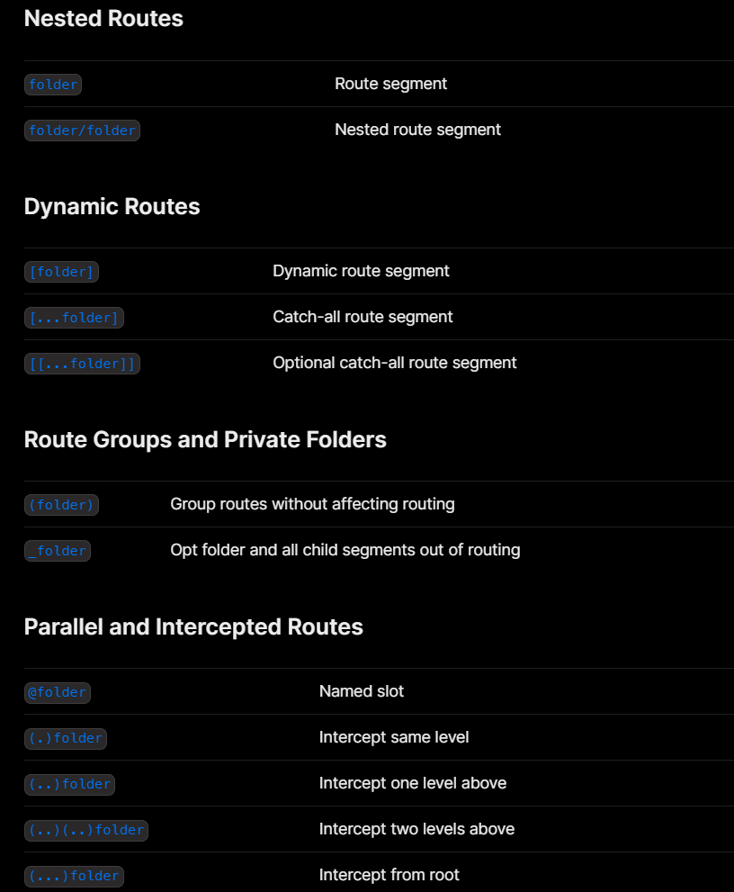

When you don't know the exact segment names ahead of time and want to create routes from dynamic data, you can use Dynamic Segments that are filled in at request time or prerendered at build time.

## Convention

A Dynamic Segment can be created by wrapping a folder's name in square brackets: `[folderName]`. For example, `[id]` or `[slug]`.

For example, a blog could include the following route `app/blog/[slug]/page.js` where `[slug]` is the Dynamic Segment for blog posts.

```jsx
// app/blog/[slug]/page.tsx
export default function Page({ params }: { params: { slug: string } }) {
  return <div>My Post: {params.slug}</div>;
}
```

## Routes Cheat Sheet



## Exercise

- Inside the `/events` route, let's create a dynamic route `/events/1234` where 1234 is the `eventId`.
- Create a `page.tsx` file inside your dynamic route and print on it the dynamic eventId value got from the url.

Got a question? Ask Kawtar Live!

---

---

#### Resources

- https://nextjs.org/docs/app/building-your-application/routing/dynamic-routes
