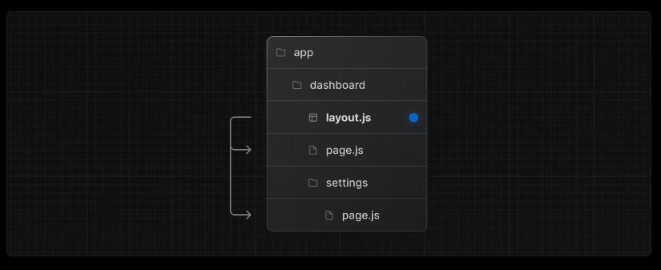
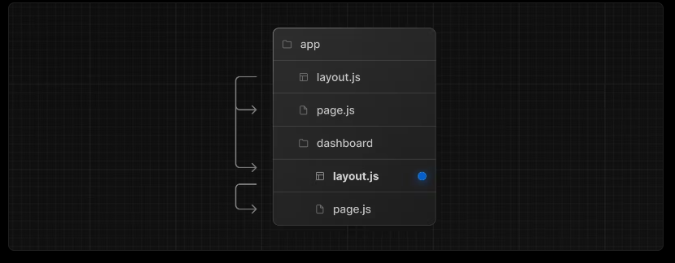
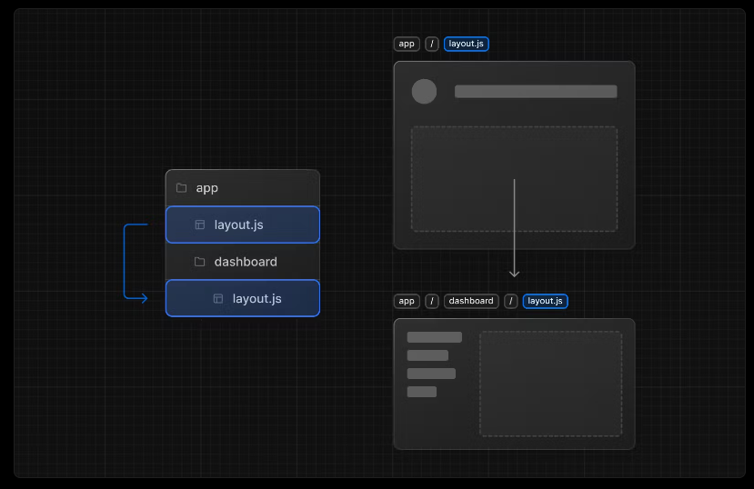

A layout is UI that is shared between multiple pages. On navigation, layouts preserve state, remain interactive, and do not re-render. Layouts can also be nested.

You can define a layout by `default` exporting a React component from a `layout.js` file. The component should accept a `children` prop that will be populated with a child layout (if it exists) or a child page during rendering.



## Root Layout

If you head to `/app/layout.tsx` you will find your root layout (**required**).

The root layout is defined at the top level of the app directory and applies to all routes. This layout enables you to modify the initial HTML returned from the server.

```jsx
export default function RootLayout({
  children,
}: {
  children: React.ReactNode,
}) {
  return (
    <html lang="en">
      <body suppressHydrationWarning={true}>
        {/* Include shared UI here e.g. a header or sidebar */}
        <main>{children}</main>
      </body>
    </html>
  );
}
```

- The `app` directory must include a root layout.
- The root layout must define `<html>` and `<body>` tags since Next.js does not automatically create them.
- You can use route groups to create multiple root layouts.

## Nested Layouts

Layouts defined inside a folder (e.g. `app/dashboard/layout.js`) apply to specific route segments (e.g. `acme.com/dashboard`) and render when those segments are active. By default, layouts in the file hierarchy are nested, which means they wrap child layouts via their `children` prop.



If you were to combine the two layouts above, the root layout (`app/layout.js`) would wrap the dashboard layout (`app/dashboard/layout.js`), which would wrap route segments inside `app/dashboard/*`.

The two layouts would be nested as such:



You can use Route Groups to opt specific route segments in and out of shared layouts.

## Exercise

> Now back to code!

Let's create a `components` folder in our root folder, where it will contains all of our components.

Then, let's create and export these two files:

```jsx
// /components/navbar.tsx
export default function Navbar() {
  return <div className="bg-red-600 text-white w-full">RSVP App</div>;
}
```

```tsx
// /components/footer.tsx
export default function Navbar() {
  return <div className="bg-blue-600 text-white w-full">Footer</div>;
}
```

and import them in our Root Layout

```jsx
import Navbar from "@/components/navbar";
import Footer from "@/components/footer";
export default function RootLayout({
  children,
}: {
  children: React.ReactNode,
}) {
  return (
    <html lang="en">
      <body suppressHydrationWarning={true}>
        {/* Include shared UI here e.g. a header or sidebar */}
        <Navbar />
        <main>{children}</main>
        <Footer />
      </body>
    </html>
  );
}
```

Now edit your url and navigate to all pages you've created previously: /about, /terms, /events, /categories...

You will be able to see the Navbar and Footer in all pages of our app.

Now let's create a specific Layout for our route group `(legal)`.

Create a `layout.tsx` file in the `(legal)` folder, and add some custome styling (eg. change background color, font, padding..)

Here is my proposed snippet:

```jsx
export default function LegalLayout({
  children,
}: {
  children: React.ReactNode,
}) {
  return (
    <section className="bg-blue-950 text-white p-10 max-w-2xl mx-auto min-h-screen">
      {children}
    </section>
  );
}
```

You will see that the following changes got applied only to the routes inside the `(legal)` group!

---

---

#### Resources

- https://nextjs.org/docs/app/building-your-application/routing/pages-and-layouts
