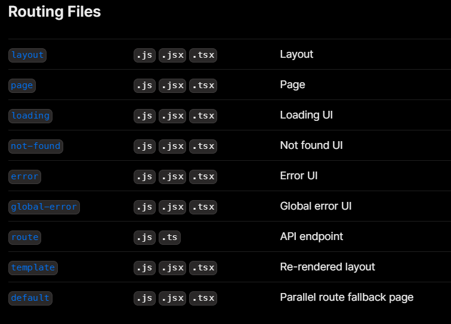
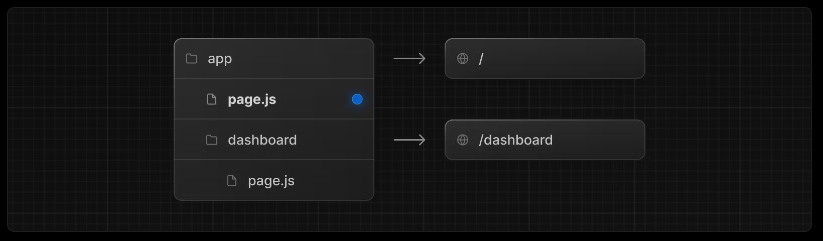

The App Router inside Next.js 13 introduced new file conventions to easily create pages, shared layouts, and templates. In This page and the wollowing ones, we will guide you through how to use these special files in your Next.js application.

## File Conventions

Inside each folder in the `app` directory, it representes a `route`. We can then create many files to render our UI.

Special file conventions are used to create UI for each route segment. The most common are pages to show UI unique to a route, and layouts to show UI that is shared across multiple routes.



## Page

A page is UI that is unique to a route. You can define pages by exporting a component from a page.js file. Use nested folders to define a route and a page.js file to make the route publicly accessible.



```jsx
// `app/page.tsx` is the UI for the `/` URL
export default function Page() {
  return <h1>Hello, Home page!</h1>;
}
```

- A page is always the leaf of the route subtree.
- `.js`, `.jsx`, or `.tsx` file extensions can be used for Pages.
- A `page.js` file is required to make a route segment publicly accessible.

## Exercise

Create the following routes _(if you haven't already)_ and render some content on each one of them!

- `/about`
- `/events`
- `/categories`
- `/privacy-policy`
- `/terms`

---

---

#### Resources

- https://nextjs.org/docs/app/building-your-application/routing/pages-and-layouts
