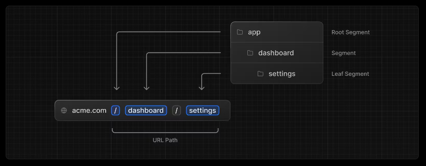
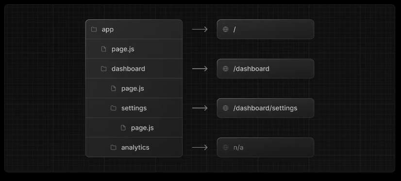

## Home

As you may understand it from the previous chapter, the `app/page.jsx` file is the one that is responsible for our home page https://localhost:3000

You can start editing it to visualize your changes live in the browser!

## Creating routes

Next.js uses a file-system based router where folders are used to define routes.

Each folder represents a route segment that maps to a URL segment. To create a nested route, you can nest folders inside each other.

A special `page.js` file is used to make route segments publicly accessible.

In this example, the `/dashboard/analytics` URL path is not publicly accessible because it does not have a corresponding `page.js` file. This folder could be used to store components, stylesheets, images, or other colocated files.

## About

Let's say you want to create a route `/about` and navigate to it with https://localhost:3000/about. In Next.js 13, routing is easy as creating a folder!

Just create a folder called '**about**' inside your app directory like this `/app/about`, and then create a page file (`.js`, `.jsx`, or `.tsx`) which will contain the content rendered when hitting the about route.

## Exercise with more routes

Let's create more routes and prepare them for our next exercises:

- `/events`
- `/categories`
- `/privacy-policy`
- `/terms`

With that being done, let's move to the next chapter!

---

---

#### Resources

- https://nextjs.org/docs/app/building-your-application/routing/defining-routes
