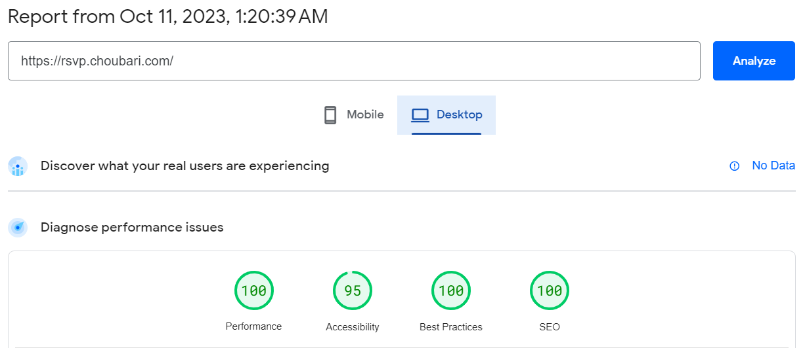

In the previous chapters, we discussed how to optimize the performance of your Next.js applications. Now, it's time to shift our focus to analytics and understand why performance measurement is crucial.

> From [Page Speed Insight](https://pagespeed.web.dev/analysis/https-rsvp-choubari-com)

## Why Performance Matters

Performance is a critical aspect of any web application, and it directly impacts the user experience. A fast-loading website or web application not only pleases your users but also has several advantages:

- **User Satisfaction**: Users tend to stay longer on sites that load quickly, improving their overall experience.

- **Search Engine Ranking**: Search engines like Google consider page speed as a ranking factor. Faster websites are more likely to appear higher in search results.

- **Conversion Rates**: Faster websites typically have higher conversion rates, leading to more sales, sign-ups, or other desired actions.

- **Lower Bounce Rate**: Slow-loading pages often lead to users leaving your site immediately, increasing the bounce rate. Faster sites keep users engaged.

- **Cost Efficiency**: Improved performance can reduce server costs and bandwidth consumption, especially for high-traffic websites.

To ensure your Next.js application delivers the best possible user experience, you need to measure and analyze its performance. Fortunately, Next.js provides tools and resources to help you with this.

## Measure Performance

**Web Vitals** are a set of essential metrics designed to capture the user experience of a web page. The following Web Vitals are important to know:

- [Time to First Byte](https://developer.mozilla.org/docs/Glossary/Time_to_first_byte) (TTFB): Measures the time it takes for the server to respond.
- [First Contentful Paint](https://developer.mozilla.org/docs/Glossary/First_contentful_paint) (FCP): Indicates when the first content appears on the screen.
- [Largest Contentful Paint](https://web.dev/lcp/) (LCP): Measures the loading performance of the largest content element.
- [First Input Delay](https://web.dev/fid/) (FID): Evaluates the responsiveness of your site to user interactions.
- [Cumulative Layout Shift](https://web.dev/cls/) (CLS): Quantifies the visual stability of your site by measuring unexpected layout shifts.
- [Interaction to Next Paint](https://web.dev/inp/) (INP) (experimental): Measures the time between user interaction and the next paint of the page.

## Exercise Later

Once we will ship our application in the last module, we can analyse it and fix what's impacting our performance!

---

---

#### Resources

- https://nextjs.org/docs/app/building-your-application/optimizing/analytics
