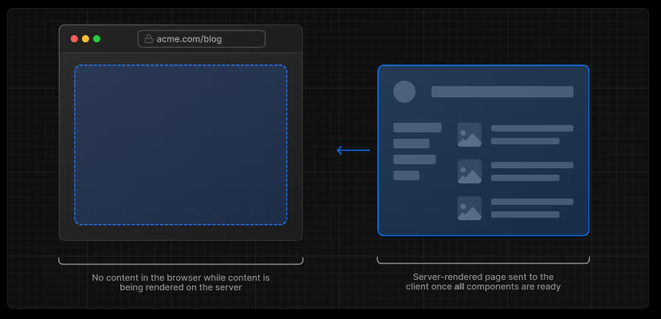
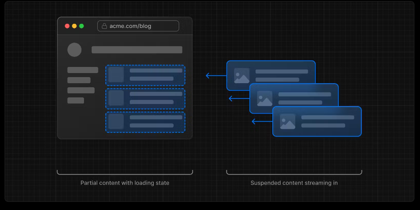
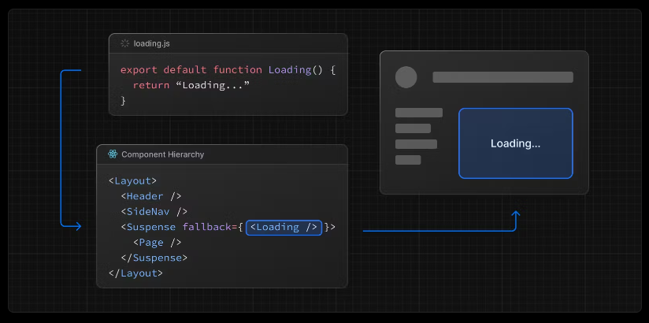

## What is Streaming?

To learn how Streaming works in React and Next.js, it's helpful to understand Server-Side Rendering (SSR) and its limitations.

With SSR, there's a series of steps that need to be completed before a user can see and interact with a page:

1. First, all data for a given page is fetched on the server.
2. The server then renders the HTML for the page.
3. The HTML, CSS, and JavaScript for the page are sent to the client.
4. A non-interactive user interface is shown using the generated HTML, and CSS.
5. Finally, React hydrates the user interface to make it interactive.

These steps are sequential and blocking, meaning the server can only render the HTML for a page once all the data has been fetched. And, on the client, React can only hydrate the UI once the code for all components in the page has been downloaded.

SSR with React and Next.js helps improve the perceived loading performance by showing a non-interactive page to the user as soon as possible.



However, it can still be slow as all data fetching on server needs to be completed before the page can be shown to the user.

Streaming allows you to break down the page's HTML into smaller chunks and progressively send those chunks from the server to the client.



This enables parts of the page to be displayed sooner, without waiting for all the data to load before any UI can be rendered.

## Streaming with Suspense

In addition to `loading.js`, you can also manually create Suspense Boundaries for your own UI components.

In the same folder, `loading.js` will be nested inside `layout.js`. It will automatically wrap the `page.js` file and any children below in a `<Suspense>` boundary.



`<Suspense>` works by wrapping a component that performs an asynchronous action (e.g. fetch data), showing fallback UI (e.g. skeleton, spinner) while it's happening, and then swapping in your component once the action completes.

```jsx
// app/dashboard/page.tsx
import { Suspense } from "react";
import { PostFeed, Weather } from "./Components";

export default function Posts() {
  return (
    <section>
      <Suspense fallback={<p>Loading feed...</p>}>
        <PostFeed />
      </Suspense>
      <Suspense fallback={<p>Loading weather...</p>}>
        <Weather />
      </Suspense>
    </section>
  );
}
```

By using Suspense, you get the benefits of:

- Streaming Server Rendering - Progressively rendering HTML from the server to the client.
- Selective Hydration - React prioritizes what components to make interactive first based on user interaction.

## Exercise

Similarly to what's done in this code above, add suspense with a loading fallback when fetching `categories`.

<details>
<summary>Click to show the solution!</summary>

```jsx
// app/categories/page.tsx

export default function Categories() {
  return (
    <div className="w-full max-w-screen-lg mx-auto">
      <h1 className="text-lg sm:text-xl md:text-2xl lg:text-4xl font-medium my-3">
        Categories Page
      </h1>
      <div className="grid grid-cols-1 md:grid-cols-2 lg:grid-cols-3 gap-5 my-5">
        <Suspense fallback={<LoadingSkeleton />}> {/* create a specific component or directly show <p>Loading...</p> */}
          <CategoriesList />
        </Suspense>
      </div>
    </div>
  );
```

</details>

Got a question? Ask Kawtar Live!

---

---

#### Resources

- https://nextjs.org/docs/app/building-your-application/routing/loading-ui-and-streaming#streaming-with-suspense
